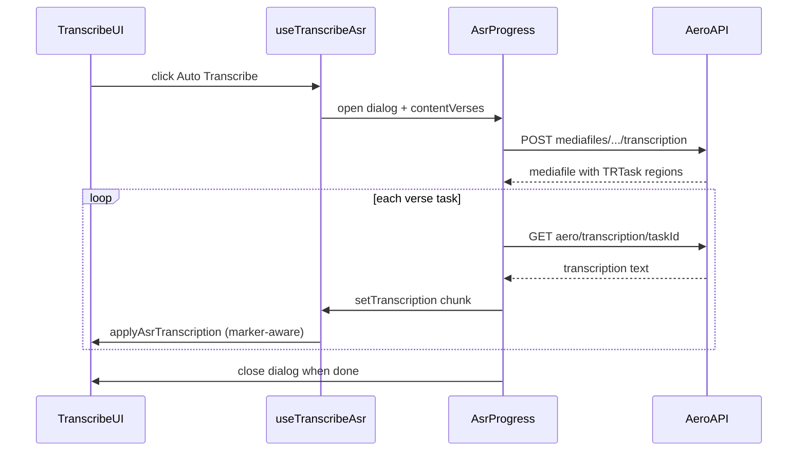

# Auto Transcribe multi-verse fix (TT-7615)

## Problem summary

Multi-verse ASR worked on master but is broken on develop. Root causes identified in code review:

- Mobile passes `contentVerses={[]}` to [`AsrProgress.tsx`](src/renderer/src/business/asr/AsrProgress.tsx), so resume always treats every verse as incomplete ([`PassageDetailTranscribeMobile.tsx`](src/renderer/src/components/PassageDetail/mobile/transcribe/PassageDetailTranscribeMobile.tsx) ~L964).
- Desktop duplicates ASR logic in [`Transcriber.tsx`](src/renderer/src/components/Transcriber.tsx); mobile uses [`useTranscribeAsr.ts`](src/renderer/src/components/PassageDetail/transcribe/useTranscribeAsr.ts) but mobile `onTextAdd` only appends — it ignores marker-aware insert.
- [`AsrProgress.tsx`](src/renderer/src/business/asr/AsrProgress.tsx) has orchestration bugs:
  - `checkTask` closes over stale `tasks` state from the interval callback.
  - `if (tasks.length > 1) setTasks(tasks)` skips setting tasks for single-verse jobs.
  - No skip when polled verse already has manual content.
- `handleAutoTranscribe` regex `\\v (\d+)` does not match range labels like `3-4`.

Agreed product rules (documented in [`CONTEXT.md`](CONTEXT.md)): one full-file ASR job per passage; resume missing verses; marker-aware insert without overwrite; Option 2 progress message; phonetic stays on current API (`response.transcription` only).



## Architecture: new shared modules

Add leaf modules under [`src/renderer/src/components/PassageDetail/transcribe/`](src/renderer/src/components/PassageDetail/transcribe/) (no barrel re-exports needed):

| Module                       | Responsibility                                                                                                                                                                                                                                         |
| ---------------------------- | ------------------------------------------------------------------------------------------------------------------------------------------------------------------------------------------------------------------------------------------------------ |
| `transcribeContentVerses.ts` | Extract `deriveContentVerses(transcription, verseLabels)` from [`Transcriber.tsx`](src/renderer/src/components/Transcriber.tsx) L1156–1175                                                                                                             |
| `applyAsrTranscription.ts`   | Pure string transform: strip timestamp prefix; skip if duplicate or verse already has content; insert after existing `\v {label} ` or append `\v {label} ` + text                                                                                      |
| `transcribeVerseMarkers.ts`  | Extract `handleStartRegion` + first-verse seed logic from [`Transcriber.tsx`](src/renderer/src/components/Transcriber.tsx) L634–648, L1358–1379; expose both **textarea** (`insertAtCursor`) and **string** (`applyVerseMarker`) variants              |
| `passageVerseSpan.ts`        | `countPassageVerses(passage)` and `passageVersePosition(passage, taskVerseLabel)` — same-chapter: `endVerse - startVerse + 1`; cross-chapter (max 2 ch): use [`getLastVerse`](src/renderer/src/business/localParatext/getLastVerse.ts) + passage attrs |
| `asrProgressMessage.ts`      | Build `Transcribing {pos} (verse {label}) of {total} (ending at verse {end})` using localized template; label/end include chapter when `startChapter !== endChapter`                                                                                   |

Extend [`useTranscribeAsr.ts`](src/renderer/src/components/PassageDetail/transcribe/useTranscribeAsr.ts):

- New inputs: `passage`, `mediafile` (for verse labels + TRTask), `textValue`, `onTextReplace` (full string setter), optional `toolChanged`.
- Derive `verseLabels` from `NamedRegions.Verse` on mediafile (same as Transcriber L625–633).
- Derive `contentVerses` via `deriveContentVerses`.
- Replace `handleAutoTranscribe` body with `applyAsrTranscription`.
- Expose `hasAiTasks`, `handleStartRegion` / `seedVerseMarkersOnLoad`, and `asrProgressPassage` for `AsrProgress`.
- Return everything both surfaces need for `AsrProgress` wiring (`contentVerses`, `force`, etc.).

## Production changes by file

### 1. [`AsrProgress.tsx`](src/renderer/src/business/asr/AsrProgress.tsx)

- Add optional `passage` prop (or `PassageVerseSpan` snapshot) for progress text.
- Replace generic `aiWillContinue` text with `asrProgressMessage` output while polling.
- Fix polling orchestration:
  - Keep `tasks` in a `tasksRef` synced with state; read from ref inside `checkTask`.
  - Always `setTasks(tasks)` after `postTranscribe`.
  - Before `setTranscription`, if task verse is in `contentVerses`, skip insert but still advance `nextTask`.
  - On mount effect cleanup: `clearInterval` **and** `taskTimer.current = undefined`.
- Keep phonetic POST param; poll `response.transcription` only (per your decision).

### 2. [`Transcriber.tsx`](src/renderer/src/components/Transcriber.tsx)

- Adopt extended `useTranscribeAsr` — remove duplicated ASR state/handlers (`handleAutoTranscribe`, `contentVerses` effect, `startAsr`, `hasAiTasks`, etc.).
- Wire `handleStartRegion` / load seeding from hook helpers (textarea path).
- Pass hook's `contentVerses` and `passage` into `AsrProgress`.

### 3. [`PassageDetailTranscribeMobile.tsx`](src/renderer/src/components/PassageDetail/mobile/transcribe/PassageDetailTranscribeMobile.tsx)

- Pass `passage`, `mediafile`, `textValue` into `useTranscribeAsr`.
- Replace append-only `handleTextAdd` for ASR with `onTextReplace` from `applyAsrTranscription`.
- Pass real `contentVerses` and `passage` to `AsrProgress` (fix `contentVerses={[]}`).
- Wire `onStartRegion` on [`PassageDetailPlayer`](src/renderer/src/components/PassageDetail/PassageDetailPlayer.tsx) + load-time seeding (string path).
- Add `verses` prop to player if needed for region labels (mirror desktop `verseSegs`).

### 4. Localization ([`localization/TranscriberAdmin-en-1.2.xliff`](localization/TranscriberAdmin-en-1.2.xliff))

Add one new unit (alphabetically in `transcriber` group, near `aiWillContinue`):

- `transcriber.asrProgress` — source: `Transcribing {0} (verse {1}) of {2} (ending at verse {3})`
- Context `sourcefile`: `AsrProgress.tsx`

Regenerate from repo root per [docs/ai/localization.md](docs/ai/localization.md):

```powershell
cd .\localization\bin\Debug ; &.\.\updateLocalization.exe
```

Consume via `useSelector(transcriberSelector, shallowEqual)` in `AsrProgress` (not context snapshot).

## Testing plan

### Jest (write first — red/green)

Follow [jest-testing-takeaways](.cursor/rules/jest-testing-takeaways.mdc): leaf imports, `--runInBand --watchAll=false` from `src/renderer`.

| Test file                         | Cases                                                                                                                                                                                                                                                                                                                |
| --------------------------------- | -------------------------------------------------------------------------------------------------------------------------------------------------------------------------------------------------------------------------------------------------------------------------------------------------------------------- |
| `applyAsrTranscription.test.ts`   | Insert after empty `\v 11 `; skip when verse has content; append when marker missing; range label `3-4`; no overwrite on different ASR text                                                                                                                                                                          |
| `transcribeContentVerses.test.ts` | Empty marker vs filled; `no-verses` fallback; range labels                                                                                                                                                                                                                                                           |
| `transcribeVerseMarkers.test.ts`  | Seed first verse; insert on region nav; skip if marker exists; `\c` on chapter 1 verse 1                                                                                                                                                                                                                             |
| `passageVerseSpan.test.ts`        | `1:10–19` → total 10, position 2 for verse 11; range `3-4`; cross-chapter `1:80–2:2` total + position                                                                                                                                                                                                                |
| `asrProgressMessage.test.ts`      | Same-chapter and cross-chapter formatted strings                                                                                                                                                                                                                                                                     |
| `AsrProgress.test.tsx`            | Mock `axiosGet`/`axiosPost` (pattern from [`useRecommendAsrLanguage.test.ts`](src/renderer/src/business/asr/useRecommendAsrLanguage.test.ts)); `jest.useFakeTimers()` for 5s poll; assert: verse 1 inserted → poll advances → verse 2 inserted; resume skips completed `contentVerses`; dialog progress text updates |

### Cypress CT (one integration guard)

Extend [`PassageDetailTranscribeMobile.cy.tsx`](src/renderer/src/components/PassageDetail/mobile/transcribe/PassageDetailTranscribeMobile.cy.tsx) per [cypress-testing-takeaways](.cursor/rules/cypress-testing-takeaways.mdc):

- `beforeEach(() => cy.clock())` for deterministic polling.
- Extend `mountTranscribeMobile` options: `passage` attrs (`startChapter/startVerse/endChapter/endVerse`), Mark Verses + TRTask `segments` JSON, initial transcription `\v 10 \v 11 \v 12 `, org/project ASR defaults so language dialog is skipped.
- Wrap mount with `TokenProvider` stub if POST requires token header.
- `cy.intercept('POST', '**/api/mediafiles/**/transcription/**', …)` returning mediafile with TRTask regions (`task1|10`, `task2|11`, …).
- `cy.intercept('GET', '**/api/aero/transcription/*', …)` sequential responses (pending → verse text).
- Click `#asrButton`; `cy.tick(5000)` between polls; assert `#transcriptionText` gains verse 10 then verse 11 text after correct markers; progress message visible between polls.

## Suggested commit order

1. **Tests + pure modules** — Jest specs and helpers (`applyAsrTranscription`, `passageVerseSpan`, etc.).
2. **`AsrProgress` fixes + progress UI + localization** — polling orchestration and new string.
3. **`useTranscribeAsr` consolidation** — hook extension; refactor `Transcriber` + mobile wiring + verse-marker parity.
4. **Cypress CT** — multi-verse button-click regression test.

## Verification commands

```powershell
# Jest
cd src/renderer
npm test -- applyAsrTranscription transcribeContentVerses passageVerseSpan asrProgressMessage AsrProgress --runInBand --watchAll=false

# Cypress CT
npm run cy:run-ct -- --spec=**/PassageDetailTranscribeMobile.cy.tsx --browser chrome
```

## Out of scope

- BOLD LWC Transcription (`BoldClauseTranscriptionEditor` / clause-level Auto Translation).
- Restoring master `response.phonetic` polling branch.
- Deterministic progress bar (indeterminate bar + Option 2 message for v1).
